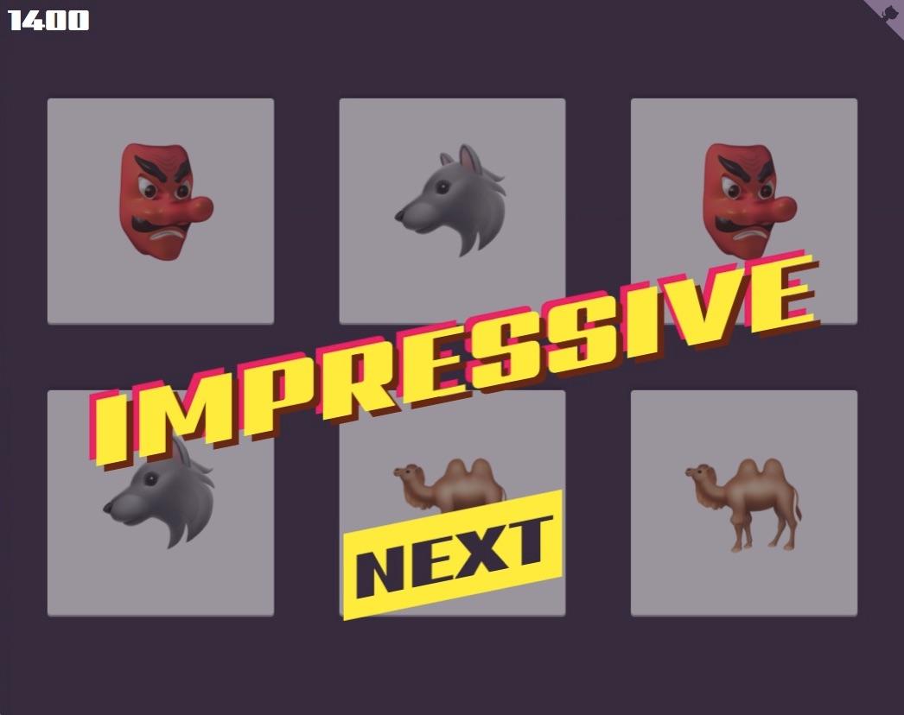

# React memory game

Preview and play [here](https://react-memory-emojis.netlify.com/).

    

 

Kudos to these awesome people and libraries:
- [create-react-app](https://github.com/facebook/create-react-app)
- [@Netlify](https://twitter.com/Netlify) - [netlify.com](https://www.netlify.com/)
- [@bdc](https://twitter.com/bdc) - [animateplus](https://github.com/bendc/animateplus)
- [@steveschoger](https://twitter.com/steveschoger) - [Hero Patterns](https://www.heropatterns.com/)
- [Howler.js](https://howlerjs.com/)